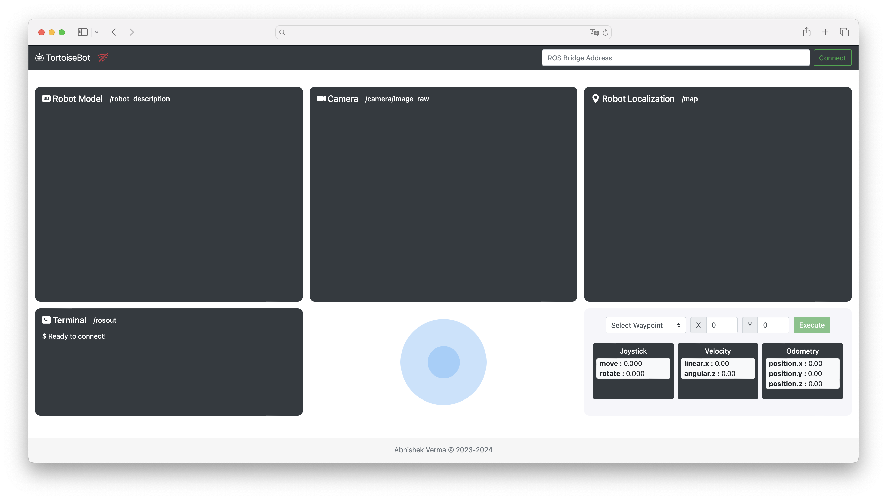
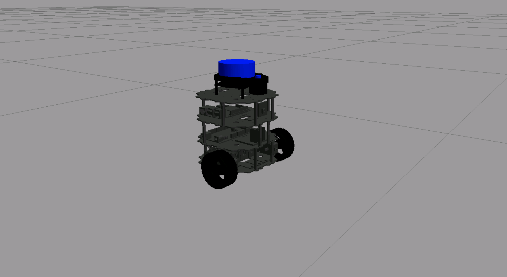

# Tortoisebot Webapp

This project involves creating a complete web application for controlling the `TortoiseBot` robot. Robots of the future will often need to be operated by users who are not experts in robotics or ROS. Creating intuitive, user-friendly applications that enable anyone to operate a robot will be essential.



  

## Structure

```text
.
├── assets
│   └── robot.ico
├── scripts
│   ├── lib
│   │   ├── colladaloader.js
│   │   ├── colladaloader2.js
│   │   ├── easel.js
│   │   ├── eventemitter2.js
│   │   ├── mjpegcanvas.js
│   │   ├── ros2d.js
│   │   ├── ros3d.js
│   │   ├── roslib.js
│   │   ├── stlloader.js
│   │   └── three.js
│   └── app.js
├── styles
│   └── app.css
├── tortoisebot_description
│   ├── gazebo
│   ├── launch
│   ├── meshes
│   ├── rviz
│   ├── urdf
│   │   ├── materials.xacro
│   │   └── tortoisebot.xacro
│   ├── CMakeLists.txt
│   └── package.xml
├── README.md
└── index.html
```

## Setup

#### Distribution

Use docker for quick-start (for both ROS1 or ROS2):

```bash
# using docker for ROS1
$ docker run -ti --rm --name local-ros-noetic ros:noetic
```

```bash
# using docker for ROS2
$ docker run -ti --rm --name local-ros-humble ros:humble
```

#### Build (Package)

Now, create a ros2 workspace, clone the package:

```bash
# setup directory
$ mkdir ~/ros2_ws/src/
$ git clone <repo_name> ~/ros2_ws/src/
```

Install the required packages (dependency) mentioned in `package.xml` using `apt`:

```bash
# check if package is available
$ ros2 pkg list
$ ros2 node list
```

```bash
# update path to installed packages
$ source /opt/ros/humble/setup.bash
```

To build locally or inside docker use the following commands:

```bash
# execute build
$ cd ~/ros2_ws && colcon build
$ source ~/ros2_ws/install/setup.bash
```

## Robot

`TortoiseBot` is an extremely learner-friendly and cost-efficient ROS-based Open-sourced Mobile Robot that is capable of doing Teleoperation, Manual as well as Autonomous Mapping and Navigation.



**Note:** Check more details about `TortoiseBot` from [here](https://github.com/rigbetellabs/tortoisebot).

## Launch

To launch the complete application, multiple launch are required in different terminals, starting with simulation, mapping and action server.

```bash
# terminal 1
$ roslaunch tortoisebot_gazebo tortoisebot_docking.launch
```

```bash
# terminal 2
$ roslaunch tortoisebot_slam mapping.launch
```

```bash
# terminal 3
$ rosrun course_web_dev_ros tortoisebot_action_server.py
```

Subsequently, `ros-bridge` server for enabling communication between non-ROS programs and ROS. Also `tf2-bridge` for sharing the `tf` andd `tf_static` with web application.

```bash
# terminal 4
$ roslaunch course_web_dev_ros web.launch
```

```bash
# terminal 5
$ roslaunch course_web_dev_ros tf2_web.launch
```

To start the web application using HTTP server using Python's built-in `http.server` module.

```bash
# terminal 6
$ python -m http.server 7000
```

The commands below are specific to platform, for general case this will be `localhost`.

```bash
# terminal 7
$ webpage_address && rosbridge_address
```


#### Key Feature

- `Robot Model` : Represents the physical and mechanical structure of the robot in a virtual environment.
- `Camera` : Processes visual information from the robot's environment.
- `Robot Localization` : Provides real-time information about the robot's position and orientation on map.
- `Terminal` : Show system log value and other critical information.
- `Joystick` : Enables manual control of the robot's movement using a joystick interface.
- `Waypoint Server` : Manages and coordinates the waypoints for autonomous navigation.
- `Velocity and Odometry` : Displays real-time velocity and odometry information of the robot.

## Tools

System tool/modules used for project development.

- `Applications` : [vs-code](https://code.visualstudio.com/), [ros-extensions](https://marketplace.visualstudio.com/items?itemName=ms-iot.vscode-ros) and [docker-desktop](https://docs.docker.com/get-docker/).
- `ROS` : [ros-docker-images](https://hub.docker.com/_/ros/) (`humble`, `noetic`) or [build-source](https://www.ros.org/blog/getting-started/).

## License

Distributed under the MIT License. See `LICENSE.txt` for more information.
